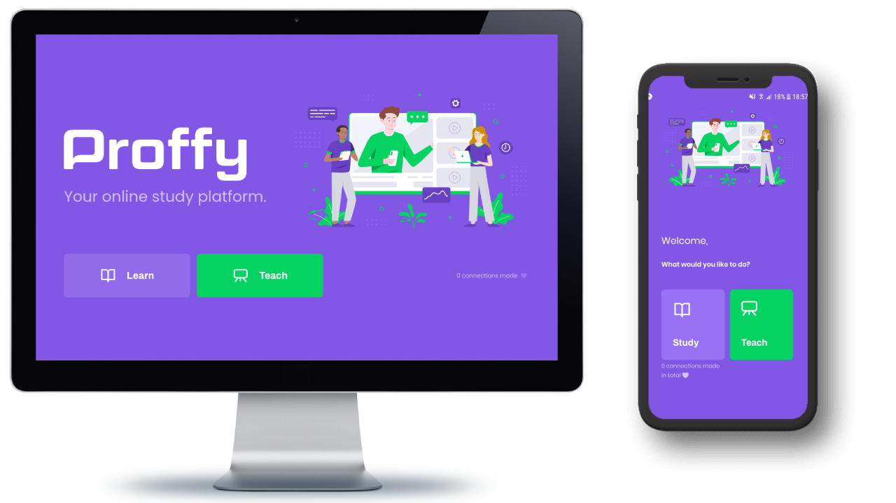
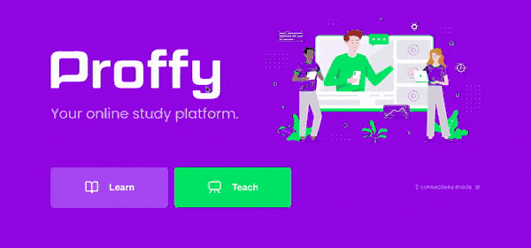

<h1 align="center">Proffy</h1>
<p align="center">
  <a href="https://opensource.org/licenses/MIT" target="_blank">
    
  </a>
    <a href="#" target="_blank">
        
    </a>
</p>

Proffy is an online educational platform to connect teachers and students, allowing them to schedule lessons according to the selected time and price.

# The Extra Mile
As a challenge, these are the features I implemented by myself to extend the original application:

|                                    Feature                                  |  commit    |
| --------------------------------------------------------------------------- | ---------- |
|  (Backend):  Populate database with data fetched from the github API        |            |
|  (Backend):  Create new route to fetch a specific teacher's data            |            |
|  (Frontend): Create a profile page where you can learn more about a teacher |            |

# Technical Overview

<h3 id="tech" >🧰 Tech Stack</h3>

- ⚛️ **react.js** — A JavaScript library for building user interfaces.
- ⚛️ **react native** — A JavaScript framework for writing natively rendering mobile applications for iOS and Android.
- 🔷 **Typescript** — A typed superset of JavaScript that compiles to plain JavaScript.
- 💹 **Node.js** — A JavaScript runtime built on Chrome's V8.
- 💼 **Express** — A fast, flexible and minimalist web framework for Node.js.
- 🦢 **sqlite3** — A small, fast, self-contained, high-reliability, full-featured, SQL database engine.
- ⚓ **knex** — SQL query builder designed to be flexible, portable, and fun to use.



<h3 id="setup">🔧 Setup</h3>
1. clone this repo:

```bash
    git clone https://github.com/domssilva/NextLevelWeek2
```

<h3 id="server">💻 Server</h3>
1. set up server:  

```bash
    cd NextLevelWeek2/back/
```

```bash
    npm install
```

```bash
    npm run dev #launches ts-node-dev
```

<h3 id="client">💻 Client</h3>

3. set up client:
```bash
    cd NextLevelWeek2/front/
```

```bash
    npm install
```

```bash
    npm start
```

<h3 id="client">📱 Mobile</h3>
1. set up mobile:

```bash
    cd NextLevelWeek2/mobile/
```

```bash
    npm install
```

```bash
    npm start  #launches expo
```

# 🚀 Credits

This project was created by [Rocketseat](https://rocketseat.com.br/).
